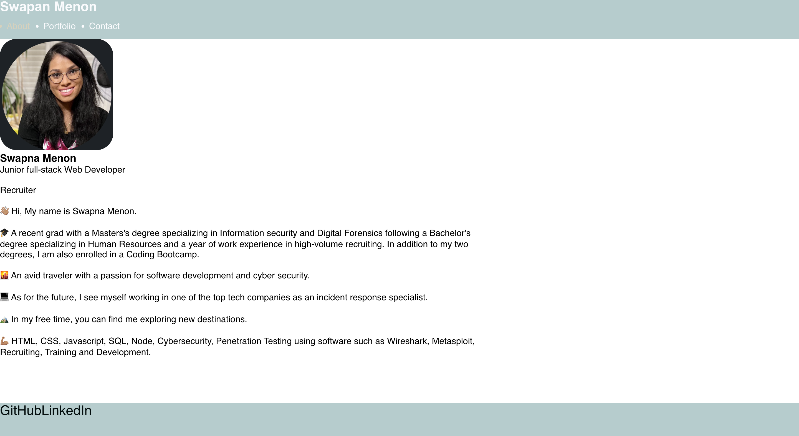

# React Portfolio
Module 20:React Challenge

## User-Story
AS AN employer looking for candidates with experience building single-page applications
I WANT to view a potential employee's deployed React portfolio of work samples
SO THAT I can assess whether they're a good candidate for an open position

# Instructions 
- install required dependencies. 

- via terminal type npm start to initiate the react app

- The app should succefully load on localhost:3000 or 3001. 
Note: Walk through video included showing that the app runs successfully on my local machine and loads whithout any errors 

# Screenshot 

https://drive.google.com/file/d/1v35ryAo4msPdjDQoYSPyRM2T5vPeDogb/view

# Links 
- GitHub repo: https://github.com/SwapnaMenon/Portfolio

